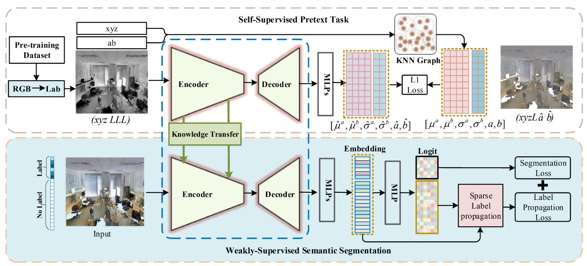
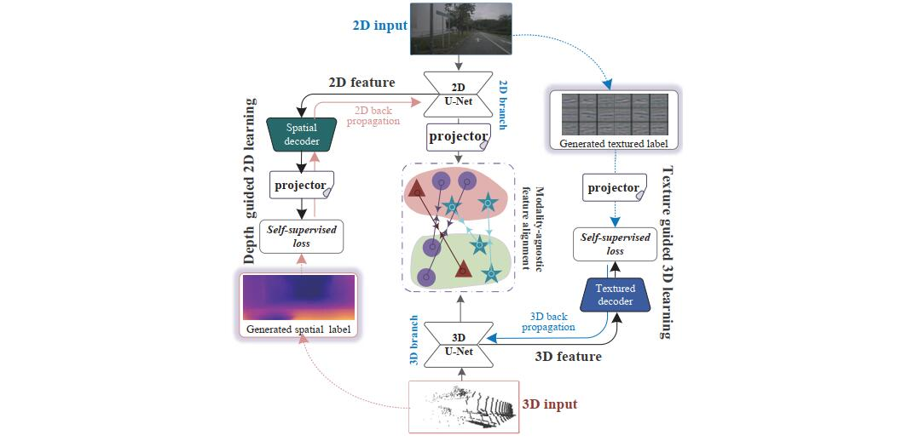
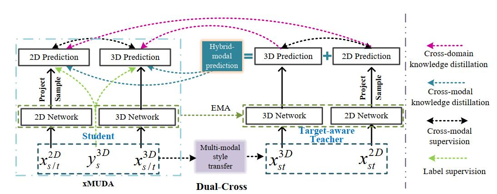

I am looking for a postdoctoral position about in **Computer Vision or related fields**. 

My research interests include, but are not limited to: (1) **Computer Vision**: 3D computer vision and point cloud semantic segmentation. (2) **Machine Learning**: weakly-supervised learning, unsupervised learning, and transfer learning. If you are interested in my research or have any use cases that you want to share, feel free to contact me!

I did my Ph.D. from September 2018 to June 2021 at the School of Informatics, in Xiamen University, supervised by Professor Cuihua Li(李翠华教授) and co-supervised by Professor Yanyun Qu(曲延云教授). 
_______________________________________________________________________________________________________
_______________________________________________________________________________________________________

<h3>
   Selected Publications
</h3>
[Please visit [my google scholar profile](https://scholar.google.com/citations?user=a-I8c8EAAAAJ&hl=en) for the full publication list.]
 
        <table cellspacing="0" cellpadding="0" class="noBorder">
           <tbody>
            <tr>
                    <td class="noBorder" width="40%">
                        
                            </td>
                    <td>
                      <b>Perturbed Self-Distillation: Weakly Supervised Large-Scale Point Cloud Semantic Segmentation </b>
                       
                      <strong>Yachao Zhang</strong>, Yanyun Qu, Zhonghao Li, Shanshan Zheng, Cuihua Li. 
                       
                      <em>IEEE Conference on International Conference on Computer Vision, (ICCV 2021)</i>
                       
                      [<a href="https://openaccess.thecvf.com/content/ICCV2021/html/Zhang_Perturbed_Self-Distillation_Weakly_Supervised_Large-Scale_Point_Cloud_Semantic_Segmentation_ICCV_2021_paper.html">Paper</a>]
                      [<a href="https://github.com/Yachao-Zhang/PSD">Code</a>]
                    </td>
           </tr>
	          <tr>
                    <td class="noBorder" width="40%">
                        
                            </td>
                    <td>
	                    <b>Weakly supervised semantic segmentation for large-scale point cloud </b>
	                     
	                    <strong>Yachao Zhang</strong>, Zonghao Li, Yuan Xie, Yanyun Qu, Cuihua Li, Tao Mei. 
	                     
	                    <em>Thirty-Fifth AAAI Conference on Artificial Intelligence, 2021(AAAI 2021)</em>
	                     
			    [<a href="https://ojs.aaai.org/index.php/AAAI/article/view/16455">Paper</a>]
			    [<a href="https://github.com/Yachao-Zhang/WS3">Code</a>]
			    [<a href="https://www.youtube.com/watch?v=i5X1L1_03Rs">Video</a>]
                    </td>
                </tr>
	          <tr>
                    <td width="40%">
                        
                            </td>
                    <td>
	                    <b>SSE-xMUDA: Self-supervised Exclusive Learning for 3D Segmentation in Cross-Modal Unsupervised Domain Adaptation </b>
	                     
	                    <strong>Yachao Zhang</strong>,Yuan Xie, Zhizhong Zhang, Cuihua Li, Yanyun Qu.
	                     
	                    <em>ACM International Conference on Multimedia (MM 2022) 
	                     
			                </em><i style="color:#e74d3c">Accept</i>
                    </td>
                </tr>
			  <tr>
                    <td width="40%">
                        
                            </td>
                    <td>
                        <b>Cross-Domain and Cross-Modal Knowledge Distillation in Domain Adaptation for 3D Semantic Segmentation</b>
	                     
	                    Miaoyu Li*,<strong>Yachao Zhang*</strong>,Miaoyu Li, Yuan Xie, Zhizhong Zhang, Cuihua Li, Yanyun Qu. 
                       (* indicates equal contribution)
	                     
	                    <em>ACM International Conference on Multimedia (MM 2022) 
	                     
			                </em><i style="color:#e74d3c">Accept</i>
                    </td>
               </tr>  
            	</tbody>
            </table>

_______________________________________________________________________________________________________

<h3>
   Academic Services
</h3>

  <ul>
  <li> <strong>Conference Reviewer</strong>: CVPR, ICML, NeruIPS, AAAI </li>
  <li> <strong>Journal Reviewer</strong>: IEEE Transactions on Neural Networks and Learning Systems, IEEE Transactions on Intelligent Transportation Systems, IEEE Transactions on Artificial Intelligence</li>
  </ul>

_______________________________________________________________________________________________________

