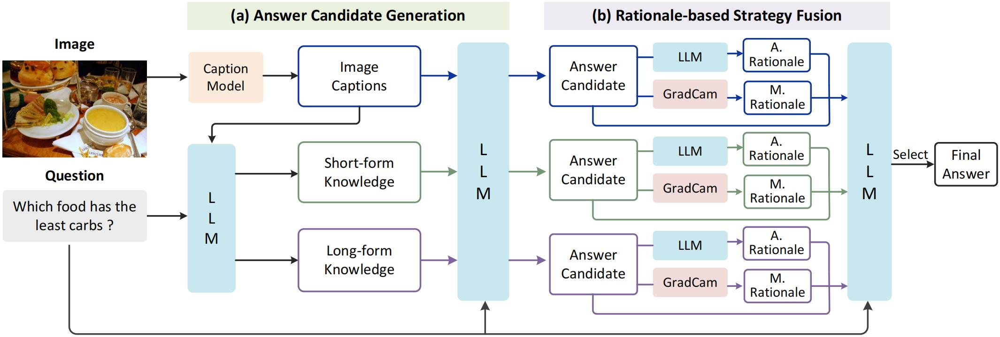
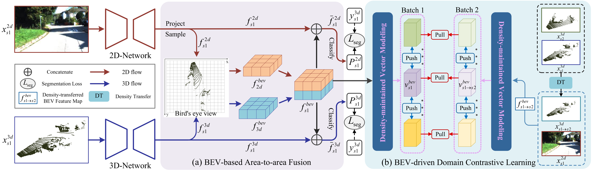

I am a Ph.D. student at Nanyang Technological University, advised by Prof. <a href="http://www.boyangli.org/">Boyang Li</a>. I earned my Master's degree in Computer Science from Xiamen University, where I studied under the guidance of Prof. Cuihua Li and Prof. Yanyun Qu. Prior to that, I obtained a Bachelor's degree in Computer Science from Xi'an University of Posts and Telecommunications.

My research interests include, but are not limited to: **Multi-modal Learning** (large language models and vision-language models), **Computer Vision** (3D computer vision, point cloud semantic segmentation). 

_______________________________________________________________________________________________________
<h3>
   News
</h3>

  <ul>
  <li> <strong>[Sep 2024]</strong> One paper about zero-shot knowledge-based visual question answering is accepted by EMNLP 2024!</li>
  <li> <strong>[Jul 2023]</strong> One paper about multi-modal domain generalized semantic segmentation is accepted by ICCV 2023!</li>
  <li> <strong>[Mar 2023]</strong> I am the winner of Xiamen University Pan Maoyuan First-Class Scholarship (One slot per year university-wide)!</li>
  <li> <strong>[Jul 2022]</strong> Two papers about multi-modal unsupervised domain adaptation semantic segmentation are accepted by ACMMM 2022!</li>
  <li> <strong>[May 2022]</strong> I start my internship at Bosch as a LiDAR Perception Algorithm Intern!</li>
  </ul>

_______________________________________________________________________________________________________

<h3>
   Publications
</h3>

        <table cellspacing="0" cellpadding="0" class="noBorder">
           <tbody>
             <tr>
                    <td width="40%">
                        
                            </td>
                    <td>
                            <b>Rationale-based Ensemble of Multiple QA Strategies for Zero-shot Knowledge-based VQA</b>
                     
                    <strong>Miaoyu Li</strong>, Haoxin Li, Zilin Du, Boyang Li.
                     
                    <em>Findings of the Association for Computational Linguistics: EMNLP 2024</em>
                     
                   [<a href="https://arxiv.org/pdf/2406.12746">Paper</a>][<a href="https://github.com/limiaoyu/REACT">Code</a>]
                    </td>
               </tr>
             <tr>
                    <td width="40%">
                        
                            </td>
                    <td>
                            <b>BEV-DG: Cross-Modal Learning under Bird’s-Eye View for Domain Generalization of 3D Semantic Segmentation</b>
                     
                    <strong>Miaoyu Li</strong>, Yachao Zhang, Xu Ma, Yanyun Qu, Yun Fu.
                     
                    <em>IEEE/CVF International Conference on Computer Vision (ICCV 2023)</em>
                     
                   [<a href="https://openaccess.thecvf.com/content/ICCV2023/papers/Li_BEV-DG_Cross-Modal_Learning_under_Birds-Eye_View_for_Domain_Generalization_of_ICCV_2023_paper.pdf">Paper</a>]
                    </td>
               </tr>
              <tr>
                    <td width="40%">
                        
                            </td>
                    <td>
                            <b>Cross-Domain and Cross-Modal Knowledge Distillation in Domain Adaptation for 3D Semantic Segmentation</b>
                     
                    <strong>Miaoyu Li</strong>*, Yachao Zhang*, Yuan Xie, Zhizhong Zhang, Cuihua Li, Yanyun Qu. 
                     
                            (* indicates equal contribution)
                     
                    <em>ACM International Conference on Multimedia (MM 2022)</em>
                     
                   [<a href="https://dl.acm.org/doi/10.1145/3503161.3547990">Paper</a>][<a href="https://github.com/limiaoyu/Dual-Cross">Code</a>]
                    </td>
               </tr>
             <tr>
                    <td width="40%">
                        
                            </td>
                    <td>
                    <b>SSE-xMUDA: Self-supervised Exclusive Learning for 3D Segmentation in Cross-Modal Unsupervised Domain Adaptation (Oral) </b>
                     
                    Yachao Zhang, <strong>Miaoyu Li</strong>, Yuan Xie, Zhizhong Zhang, Cuihua Li, Yanyun Qu.
                     
                    <em>ACM International Conference on Multimedia (MM 2022)</em>
                     
                    [<a href="https://doi.org/10.1145/3503161.3547987">Paper</a>][<a href="https://github.com/limiaoyu/SSE-xMUDA">Code</a>]
                    </td>
                </tr>
                    </tbody>
           </table>

