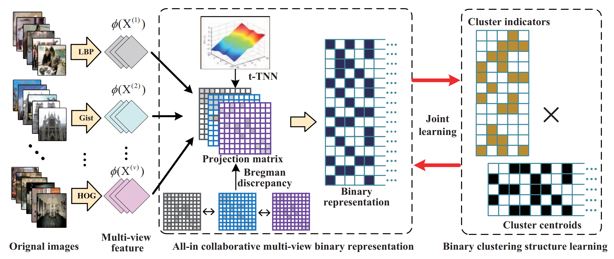

My research interests include, but are not limited to: **Computer Vision** (3D computer vision, point cloud semantic segmentation), **Machine Learning** (weakly-supervised learning, unsupervised learning, transfer learning).
If you are interested in my research or have any use cases that you want to share, feel free to contact me!

I did my Ph.D. from September 2018 to June 2022 at the School of Informatics, in Xiamen University, China, supervised by Professor Cuihua Li(李翠华教授) and co-supervised by Professor Yanyun Qu (曲延云教授). 
 

_______________________________________________________________________________________________________
<h3>
   News
</h3>

  <ul>
  <li> <strong>[Aug 2022]</strong> One paper about binary multi-view cluster is accepted by TNNLS!</li>
  <li> <strong>[Jul 2022]</strong> Two papers about multi-modal unsupervised domain adaptation semantic segmentation are accepted by ACMMM 2022!</li>
  <li> <strong>[Jun 2022]</strong> I am the winner of the title of "Outstanding Graduate" of Xiamen University!</li>
  <li> <strong>[Jun 2022]</strong> I successfully defended my PhD thesis!</li>
  <li> <strong>[Mar 2022]</strong> I am the winner of Xiamen University Liu Yubin Youth Science and Technology Scholarship!</li>
  <li> <strong>[Nov 2021]</strong> I am the winner of the title of "Outstanding Student" of Xiamen University!</li>
  <li> <strong>[Dec 2021]</strong> I am the winner of the first prize of the 2021 Excellent Paper Award of Fujian Computer Society!</li>
  <li> <strong>[Jul 2021]</strong> One paper about weakly-supervised point cloud  semantic segmentation is accepted by ICCV 2021!</li>
  <li> <strong>[Mar 2021]</strong> One paper about PolSAR Image Classification is accepted by Remote Sensing!</li>
  <li> <strong>[Dec 2020]</strong> One paper about weakly-supervised large scale point cloud semantic segmentation is accepted by AAAI 2021!</li>
  </ul>

_______________________________________________________________________________________________________

<h3>
   Selected Publications
</h3>

        <table cellspacing="0" cellpadding="0" class="noBorder">
           <tbody>
            <tr>
                    <td class="noBorder" width="40%">
                        
                            </td>
                    <td>
                      <b>Perturbed Self-Distillation: Weakly Supervised Large-Scale Point Cloud Semantic Segmentation </b>
                       
                      <strong>Yachao Zhang</strong>, Yanyun Qu, Zhonghao Li, Shanshan Zheng, Cuihua Li. 
                       
                      <em>IEEE Conference on International Conference on Computer Vision, (ICCV 2021)</em>
                       
                      [<a href="https://openaccess.thecvf.com/content/ICCV2021/html/Zhang_Perturbed_Self-Distillation_Weakly_Supervised_Large-Scale_Point_Cloud_Semantic_Segmentation_ICCV_2021_paper.html">Paper</a>][<a href="https://github.com/Yachao-Zhang/PSD">Code</a>]
              </td>
           </tr>
           <tr>
                    <td class="noBorder" width="40%">
                        
                            </td>
                    <td>
                    <b>Weakly supervised semantic segmentation for large-scale point cloud </b>
                     
                    <strong>Yachao Zhang</strong>, Zonghao Li, Yuan Xie, Yanyun Qu, Cuihua Li, Tao Mei. 
                     
                    <em>Thirty-Fifth AAAI Conference on Artificial Intelligence, 2021(AAAI 2021)</em>
                     
                    [<a href="https://ojs.aaai.org/index.php/AAAI/article/view/16455">Paper</a>][<a href="https://github.com/Yachao-Zhang/WS3">Code</a>]
                    </td>
             </tr>
             <tr>
                    <td width="40%">
                        
                            </td>
                    <td>
                    <b>SSE-xMUDA: Self-supervised Exclusive Learning for 3D Segmentation in Cross-Modal Unsupervised Domain Adaptation </b>
                     
                    <strong>Yachao Zhang</strong>,Yuan Xie, Zhizhong Zhang, Cuihua Li, Yanyun Qu.
                     
                    <em>ACM International Conference on Multimedia (MM 2022)</em>
                     
                    <i style="color:#e74d3c">Accepted, waiting for publication</i>
                    </td>
                </tr>
                    <tr>
                    <td width="40%">
                        
                            </td>
                    <td>
                            <b>Cross-Domain and Cross-Modal Knowledge Distillation in Domain Adaptation for 3D Semantic Segmentation</b>
                     
                    Miaoyu Li*,<strong>Yachao Zhang*</strong>,Miaoyu Li, Yuan Xie, Zhizhong Zhang, Cuihua Li, Yanyun Qu. 
                     
                            (* indicates equal contribution)
                     
                    <em>ACM International Conference on Multimedia (MM 2022)</em>
                     
                    <i style="color:#e74d3c">Accepted, waiting for publication.</i>
                    </td>
               </tr>
                    <tr>
                    <td width="40%">
                        
                            </td>
                    <td>
                            <b>Learning All-In Collaborative Multiview Binary Representation for Clustering</b>
                     
                    <strong>Yachao Zhang*</strong>, Yuan Xie*, Zongze Wu, Cuihua Li, Yanyun Qu. 
                     
                            (* indicates equal contribution)
                     
                    <em>Transactions on Neural Networks and Learning Systems</em>
                     
                    [<a href="https://ieeexplore.ieee.org/document/9882008/">Paper</a>][<a href="https://github.com/Yachao-Zhang/All_In_Learning">Code</a>]
                    </td>
               </tr>  
                    </tbody>
           </table>

[Please visit [my google scholar profile](https://scholar.google.com/citations?user=a-I8c8EAAAAJ&hl=en) for the full publication list.]

_______________________________________________________________________________________________________

<h3>
   Academic Services
</h3>

  <ul>
  <li> <strong>Conference Reviewer</strong>: CVPR, ICML, NeruIPS, AAAI </li>
  <li> <strong>Journal Reviewer</strong>: IEEE Transactions on Neural Networks and Learning Systems, IEEE Transactions on Intelligent Transportation Systems, IEEE Transactions on Artificial Intelligence</li>
  </ul>

_______________________________________________________________________________________________________

<h3>
   Hobby
</h3>

 <td width="30%">
 
</td>
   <td width="30%">
 
</td>
   <td width="30%">
 
</td>
   <td width="30%">
 
</td>

